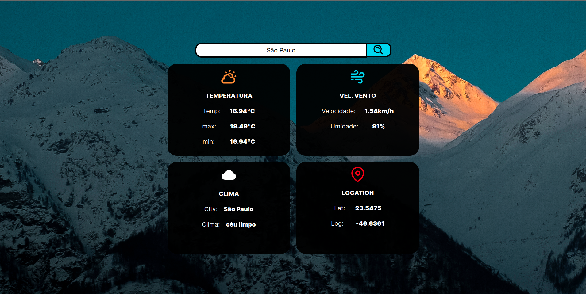

# Site com API de Clima

Este é um site com uma API de clima que permite obter informações atualizadas sobre as condições climáticas de diferentes localidades. Com esta API, você pode buscar dados sobre temperatura, umidade, velocidade do vento e muito mais.

## Funcionalidades

- Exibir as condições climáticas atuais de uma determinada localidade.
- Fornecer previsões do tempo para os próximos dias.
- Mostrar informações como temperatura máxima e mínima, umidade, velocidade do vento, e descrição do clima.

## Como usar

```shell
git clone https://github.com/EliasArruda/WeatherAPP.git

cd weatherapp

yarn install

yarn dev
```
